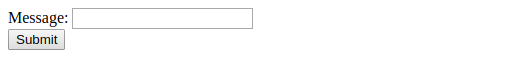

# csrf-token

Generation and verification of CSRF prevention tokens.

## Getting Started

Add the following dependency to `Cargo.toml`.

```
csrf-token = { git = "ssh://git@github.com/future-science-research/csrf-token.git", branch="v0.2.x" }
```

## Running Example

Clone this repository and checkout the latest stable version.

```
$ git clone https://github.com/future-science-research/csrf-token.git
$ cd csrf-token
$ git checkout master
```

Then run the example.

```
$ cargo run --example main
```

Access <http://localhost:8080/>. The form to post a message is shown.



A CSRF prevention token is attached to the form as a hidden input. Check the source code of the web page.

```
<input type="hidden" name="csrf_token" value="486d8f4378397926413f24444972e93edb8975e04d3137912a6851aa2223894e156ad99d1af496bb95a25678ab3417a7a84b59fc2e31d7786333d65ae1a7733731ffcce3e55999ed">
```

## Usage

### Creating a Token Generator

To generate a token, first of all, create a `CsrfTokenGenerator`. See [examples/main.rs](examples/main.rs).

```rust
let generator = Arc::new(CsrfTokenGenerator::new(secret, Duration::hours(1)));
```

The first argument is a secret value used for encryption of tokens. 32-byte secret length is recommended.

The second argument is the duration in which the token is valid. It must be sufficient length for human clients to fill the form and submit.

For using the token generator in Actix handlers, you have to immutably share the generator between threads. It can be achieved by using `lazy_static` macro or state of Actix `App`. In the example, app state is used.

```rust
server::new(move || {
    App::with_state(generator.clone())
    /* ... */
})
```

### Generating a token

Just call `generate` method. You can get a token as a `Vec<u8>` value. In the form of the example, a hex-encoded is embedded.

```rust
let token = hex::encode(&generator.generate());
HttpResponse::Ok()
    .content_type("text/html")
    .body(FORM_TEMPLATE.replace("{{csrf-token}}", &token))
```

### Verifying a token

Decode the token given by the client and call `verify` method.

```rust
generator.verify(&token)?;
```

It returns `Result<(), CsrfTokenError>`.

## License

Licensed under the MIT License.
